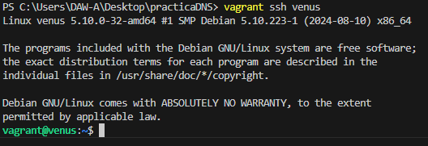
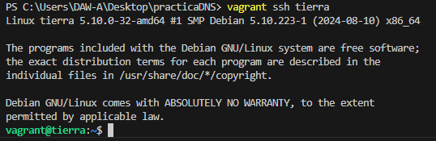
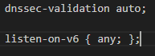
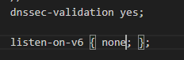

# Práctica DNS

## Creación de las máquinas virtuales

Creamos las máquinas virtuales mediante un archivo `Vagrantfile` con la configuración deseada. 

## Configuración de la provisión

Añadimos una provisión en el archivo para instalar `bind9` en cada una de las máquinas.
Con la siguiente linea: 
```ruby
apt-get install -y bind9 dnsutils
```
## Comprobación de las máquinas

Iniciamos las maquinas virtuales con:  
```shell
vagrant init
``` 
Seguido nos conectamos mediante ssh a cada una de ellas

```shell
vagrant ssh venus
``` 


```shell
vagrant ssh tierra
``` 



## Configuración archivos pertinentes

Añadimos la siguiente linea al vagrnatfile para configurar las carpetas compartidas

```shell
config.vm.synced_folder "./config_file", "/vagrant_config_file"
``` 

Copiamos el archivo `named.conf.options` en la carpeta compartida

```shell
sudo cp /etc/bind/named.conf.options ./vagrant_config_file
``` 

Modificamos el archivo cambiando las opciones de: 



A estas nuevas: 



Con esto configuramos el archivo con lo requerido por la practica.


Despues añadimos este mismo archivo a cada maquina virtual con: 

```shell
cp ./vagrant_config_file/named.conf.options /etc/bind/
``` 
Este comando lo añadimos a las dos provisiones


Modificamos el archivo `named.conf.opstions` con los siguientes parametros para permitir reculsivida y en las diferentes direcciones ip